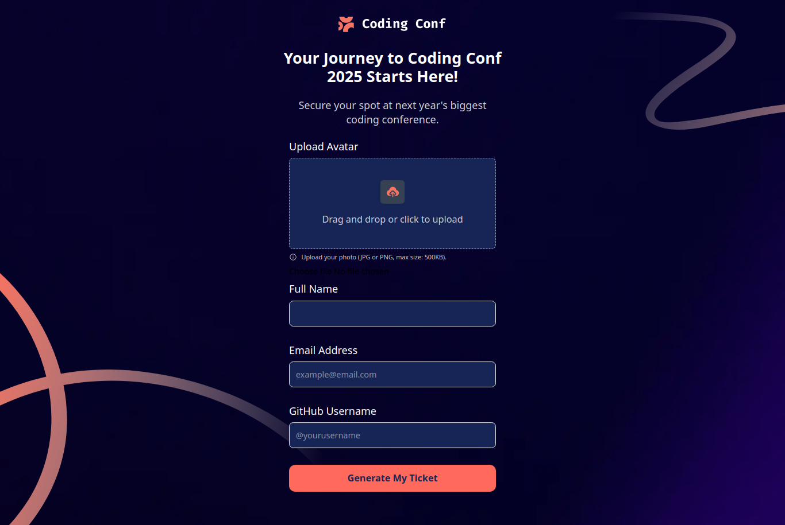
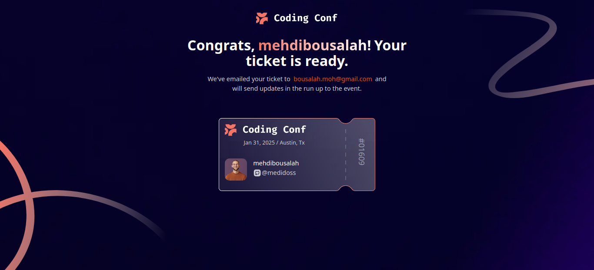
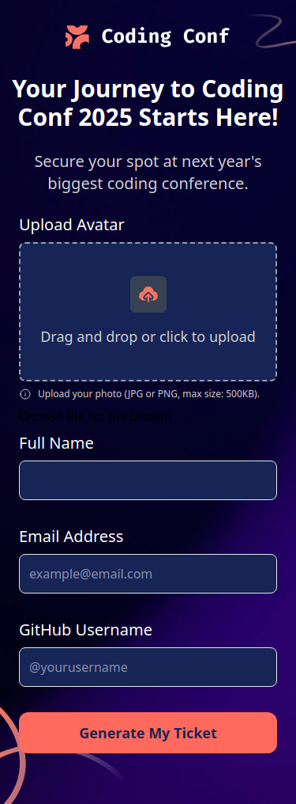
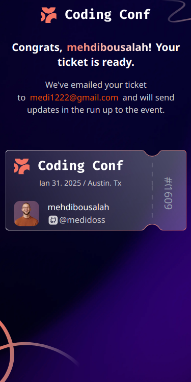

# Frontend Mentor - Conference ticket generator solution

This is a solution to the [Conference ticket generator challenge on Frontend Mentor](https://www.frontendmentor.io/challenges/conference-ticket-generator-oq5gFIU12w).

## Table of contents

- [Overview](#overview)
  - [The challenge](#the-challenge)
  - [Links](#links)
  - [Screenshot](#screenshot)
- [My process](#my-process)
  - [Built with](#built-with)
- [Author](#author)

## Overview

### The challenge

Users should be able to:

- Complete the form with their details
- Receive form validation messages if:
  - Any field is missed
  - The email address is not formatted correctly
  - The avatar upload is too big or the wrong image format
- Complete the form only using their keyboard
- Have inputs, form field hints, and error messages announced on their screen reader
- See the generated conference ticket when they successfully submit the form
- View the optimal layout for the interface depending on their device's screen size

### Links

- Solution URL: [solution](https://github.com/Medido1/Frontend-Mentor-Conference-ticket-generator)
- Live Site URL: [live site](https://conferenceticketgenerato.netlify.app/?fbclid=IwY2xjawJnmfpleHRuA2FlbQIxMAABHk7exNpglHjicO_Hu0IDlYEPEA4pk-pLdO9C7qTtm0kQqSuMMFJP2VWwnCy3_aem_EIfpw12zXSdiJ9mTGXo0vA)

### Screenshot

  ## Desktop Form
  

  ## Desktop Ticket 
  

  ## Mobile Form
  

  ## Mobile Ticket
  

## My process

### Built with

- React
- Tailwindcss
- Flexbox
- Mobile-first workflow

## Author

- Frontend Mentor - [@Medido1](https://www.frontendmentor.io/profile/Medido1)
- GitHub - [@Medido1](https://github.com/Medido1)

